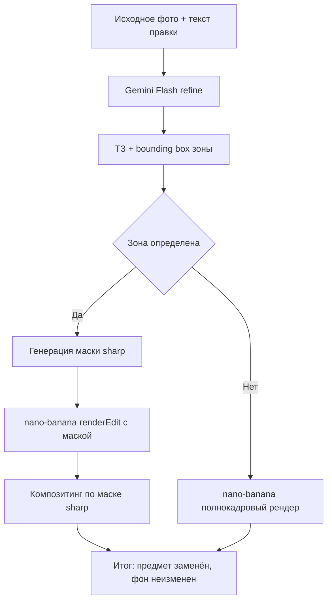

# План: Гарантия неизменности комнаты через авто-маскирование + композитинг

## Проблема

Диффузионная модель `nano-banana-pro-preview` при правке «картинка-в-картинку» перерисовывает
всё изображение заново. Даже при жёстких текстовых запретах (архитектурные якоря в промпте)
она самовольно меняет форму светильника, конфигурацию окна/балконной двери, картины и ракурс,
а также добавляет несогласованный декор (торшеры, растения). Промпт-инжиниринг не даёт
математической гарантии неизменности фона.

## Исследование (факты)

1. **Модели Imagen недоступны**: `imagen-3.0-*`, `imagen-4.0-*`, `image-segmentation-001`
   возвращают 404 NOT_FOUND с текущим API-ключом (v1beta). Методы `editImage` и `segmentImage`
   из SDK недоступны.
2. **Доступна только** `nano-banana-pro-preview` (методы: `generateContent`, `countTokens`,
   `batchGenerateContent`).
3. **nano-banana поддерживает маскирование через `generateContent`**: если передать маску
   (изображение, где белые пиксели = зона правки) как отдельную часть запроса, модель
   выполняет inpainting именно в этой зоне. Эмпирический тест подтвердил: разница внутри
   маски в ~5 раз выше, чем на фоне.
4. **Фон сохраняется не идеально**: MAE вне маски = 8.6/255, 8% пикселей фона сдвинуты
   (модель выдаёт другое разрешение 768x1365 вместо 720x1280 и пропускает всё через диффузию).
5. **Решение для 100% гарантии**: программный композитинг — после генерации наложить результат
   модели поверх исходника ПО МАСКЕ (взять из результата только область маски, остальное —
   из исходника попиксельно). Это математически гарантирует неизменность окон, светильников,
   картин и ракурса.

## Выбранная архитектура (согласовано с пользователем)

**Автоматическое определение зоны правки Gemini Flash + маскирование nano-banana + программный композитинг.**

```
[Исходное фото 1600x1200] + [текст правки]
        │
        ▼
[Шаг 1] Gemini Flash (refine): анализирует фото + текст,
        возвращает структурированное ТЗ И bounding box зоны правки
        (JSON: {instruction, region:{x,y,width,height}})
        │
        ▼
[Шаг 2] Генерация бинарной маски из bounding box (sharp),
        белая зона = область правки, растушёвка краёв (feathering)
        │
        ▼
[Шаг 3] nano-banana (renderEdit): фото + маска + ТЗ → результат
        (модель меняет ТОЛЬКО зону маски)
        │
        ▼
[Шаг 4] Композитинг (sharp): результат модели приводится к размеру
        исходника и накладывается поверх исходника ПО МАСКЕ.
        Вне маски — исходные пиксели (100% неизменность).
        │
        ▼
[Итог]  Новый предмет в зоне правки, комната вне зоны — попиксельно та же
```

## Детальные шаги реализации

### 1. `src/lib/ai/refine.ts` — определение зоны правки
- Новая функция `detectEditRegion(baseImageUrl, rawInstruction, references)`.
- Gemini Flash (`geminiConsolidationModel`) смотрит на фото + текст и возвращает **JSON**:
  ```json
  {
    "instruction": "структурированное ТЗ (как сейчас)",
    "region": { "x": 0.2, "y": 0.5, "width": 0.3, "height": 0.4 }
  }
  ```
- Координаты — **нормализованные** (0..1) относительно фото, чтобы не зависеть от разрешения.
- `region` описывает зону объекта, который нужно заменить/удалить/куда добавить предмет.
- Если модель не вернула валидный JSON или правка не требует маски (например, «перекрасить
  всю стену»), возвращаем `region: null` → fallback на текущий полнокадровый рендер.
- Использовать `responseMimeType: "application/json"` или парсинг из текста с ```` ```json ````.
- При ошибке — fallback на `refineInstruction` без региона (текущее поведение).

### 2. `src/lib/image.ts` — генерация маски и композитинг
- `createMaskFromRegion(width, height, region, featherPx)`: создаёт Buffer чёрно-белой маски
  (JPEG/PNG) размером width×height. Белый прямоугольник = зона правки. Растушёвка краёв
  (feathering) через `sharp` blur или градиент по краям, чтобы стык был мягким.
- `compositeByMask(baseBuffer, resultBuffer, maskBuffer)`: приводит `resultBuffer` к размеру
  `baseBuffer`, затем накладывает результат поверх основы, используя маску как alpha-канал
  (внутри маски — результат модели, вне — исходник). Через `sharp.composite` с
  `blend: "over"` и маской в качестве alpha.

### 3. `src/lib/ai/render.ts` — передача маски в nano-banana
- `renderEdit(baseImageUrl, instruction, references, mask?)`: новый опциональный параметр `mask`
  (Buffer). Если передан — добавляется в `parts` как отдельное изображение с текстовой меткой:
  «Это маска редактирования. Белые пиксели = область правки. Вне белой области ничего не меняй».
- Обновить `RENDER_SYSTEM_PROMPT`: описать, что модель получает маску и должна менять только
  белую зону, сохраняя всё остальное.

### 4. `src/lib/ai/pipeline.ts` — оркестрация
- `runPipeline` теперь:
  1. `refineInstruction` (как сейчас) → ТЗ.
  2. `detectEditRegion` → `region` (или null).
  3. Если `region` есть: `createMaskFromRegion` → маска.
  4. `renderEdit(baseImageUrl, ТЗ, references, mask)`.
  5. Если маска была: `compositeByMask(baseImageUrlBuffer, renderBuffer, mask)` → итог.
     Иначе — как сейчас (полнокадровый рендер).
  6. `normalizeToCanonical` итога.
- `PipelineResult` расширяется полем `usedMask: boolean` (для диагностики/логов).

### 5. `src/app/(dashboard)/projects/actions.ts`
- Без изменений сигнатуры вызова `runPipeline` (маска генерируется внутри pipeline).
- `consolidatedPrompt` продолжает хранить ТЗ.

### 6. Тестирование
- Скрипт-тест полного цикла на реальном сценарии пользователя (замена кресла у окна,
  замена дивана, добавление торшера на пустое место).
- Проверка: окна/светильник/ракурс вне маски идентичны исходнику (MAE ≈ 0 после композитинга).
- Проверка в браузере пользователем.

## Риски и решения
- **Gemini Flash неточно определит зону**: если bounding box слишком мал — предмет обрежется;
  если велик — захватит лишнее. Решение: растушёвка краёв + инструкция Flash «включай в зону
  весь предмет с небольшим запасом». При сомнении Flash может вернуть `region: null` (fallback).
- **Правки без единой зоны** (например, «повесить шторы на оба окна»): Flash может вернуть
  несколько зон или null. На первом этапе поддерживаем одну зону; при необходимости — массив.
- **Композитинг и тени**: предмет из результата модели может иметь мягкую тень, выходящую за
  маску. Растушёвка края маски смягчает стык. При необходимости зону можно расширять на 5-10%.

## Mermaid-схема


